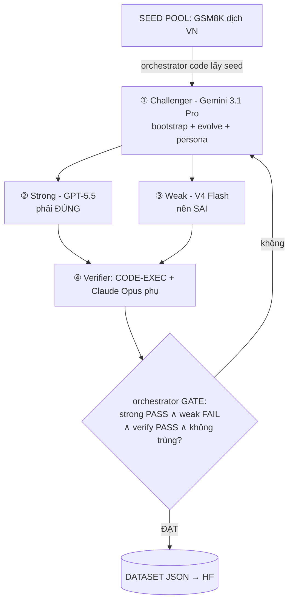

# 10 — Sơ đồ pipeline vòng trong (Agentic Self-Instruct)

[← 09 Build plan](09-build-plan.md) · [Về README →](../README.md)

> Vòng trong = sinh 1 mẫu data. Orchestrator là **code deterministic**; 4 subagent là LLM (API).
> Lặp vòng này hàng nghìn lần để ra dataset.

## Sơ đồ

```
        ┌──────────────────────────────────────────────────────────┐
        │   SEED POOL  —  GSM8K (dịch sang tiếng Việt, giữ đáp số)   │
        └───────────────────────────┬──────────────────────────────┘
                                    │  orchestrator (CODE) lấy 1 seed
                                    ▼
   ┌──▶ ① CHALLENGER  (Gemini 3.1 Pro)
   │      bootstrap (MetaMath) + evolve khó (Evol-Instruct) + persona VN
   │      → đề toán tiếng Việt  +  đáp án kỳ vọng (số)
   │                                │
   │                                ▼
   │      ┌────────────────────┐   ┌────────────────────┐
   │      │ ② STRONG (GPT-5.5) │   │ ③ WEAK (V4 Flash)  │   ← song song
   │      │   PHẢI giải đúng   │   │   NÊN giải sai     │
   │      └─────────┬──────────┘   └─────────┬──────────┘
   │                └──────────┬─────────────┘
   │                           ▼
   │      ④ VERIFIER  =  CODE-EXEC (so khớp đáp án số)  ← trọng tài chính
   │                   +  Claude Opus 4.8 (chấm CoT, phụ)
   │                           │
   │                           ▼
   │            ┌──────────────────────────────────────┐
   │  reject/   │  orchestrator (CODE) — GATE giữ khi:  │
   └────────────│   strong PASS  ∧  weak FAIL           │
     refine     │   ∧  verify PASS  ∧  không trùng      │
                └───────────────────┬──────────────────┘
                                    │ ĐẠT
                                    ▼
        ┌──────────────────────────────────────────────────────────┐
        │  DATASET (schema JSON)  →  lưu HuggingFace / Data Hub      │
        └──────────────────────────────────────────────────────────┘
```

## Mermaid (cho viewer hỗ trợ)



## Logic GATE (code, deterministic) — trái tim "đo độ khó"

| Điều kiện | Ý nghĩa | Hành động |
|---|---|---|
| strong **PASS** ∧ weak **FAIL** | độ khó vừa đẹp | ✅ **GIỮ** |
| weak **PASS** | quá dễ | ↻ evolve khó hơn / loại |
| strong **FAIL** | đề sai/mơ hồ/quá khó | ↻ refine / loại |
| verify **FAIL** (đáp án lệch) | lời giải sai | ❌ loại |
| trùng (diversity check) | lặp lại | ❌ loại |

## Vai trò & model (từ [03](03-architecture-4-subagents.md))

| # | Subagent | Model | Nhiệm vụ |
|---|---|---|---|
| ① | Challenger | Gemini 3.1 Pro | Sinh đề VN (seed→bootstrap→evolve→persona) + đáp án kỳ vọng |
| ② | Strong solver | GPT-5.5 | Giải → lời giải chuẩn (CoT) = nhãn |
| ③ | Weak solver | DeepSeek V4 Flash | Giải để đo độ khó (nên thua) |
| ④ | Verifier | **code-exec** + Claude Opus 4.8 | So đáp án số (chính) + chấm CoT (phụ) |
| — | Orchestrator | **CODE** | Điều phối, GATE, lưu — deterministic |

## Ghi chú thiết kế

- **Đáp án numeric** là điểm tựa: verify bằng code → reward miễn phí + chống reward-hacking ([05 Q5](05-meta-optimizer.md)).
- **Challenger giữ "đáp án kỳ vọng"** để verify đối chiếu; nếu strong solver ra khác → cờ nghi ngờ đề/đáp án.
- **Refine loop** giới hạn số vòng (vd ≤2) để khỏi đốt token vô hạn.
- Output theo **schema** ở [09](09-build-plan.md).
- Vòng ngoài (**meta-opt**, [05](05-meta-optimizer.md)) tiến hóa chính các prompt + GATE này — nên giữ chúng deterministic để đo tín hiệu sạch.
